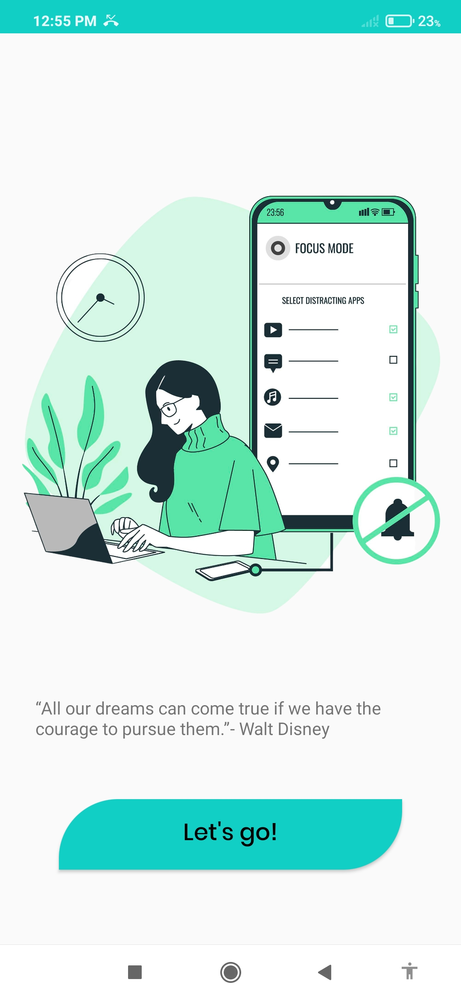
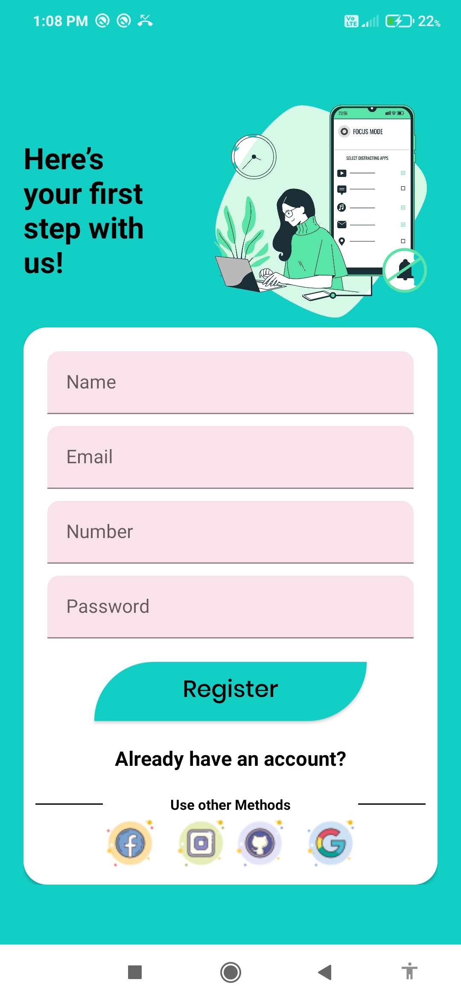
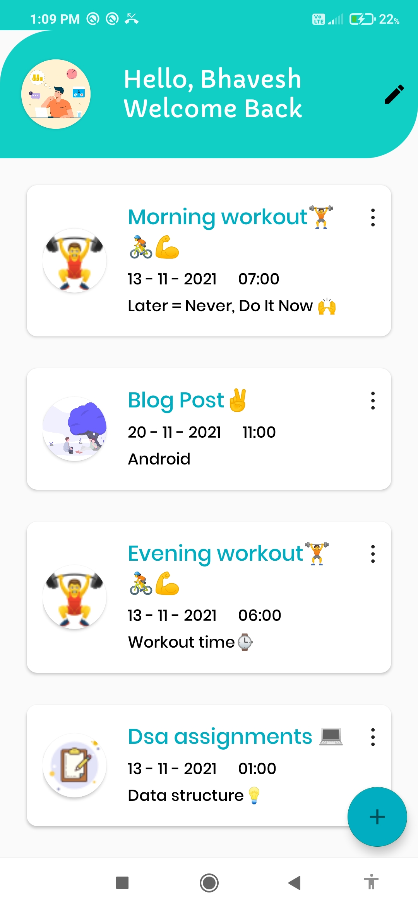

# TickTask: Routine Manager App
*TickTask is a beautifully designed, easy-to-use, effective to-do list, and task management tool for your Android device that helps you to create schedules, manage time and stay focused, It's free for everyone.*

#### Kotlin, Room Database and Repository, MVVMMaterial Components, 

 
Screenshots
---

  
  
  

Current Features
---
* Create Todo List in application.
* Add, Update and Remove tasks.
* Set task due Dates and Times.
* User registration.(Sign Up)
* User login / social login (Google)
* Beautiful Material design and interface.
* Set priority for your tasks.
* Mark tasks as Completed.
* Works offline, all data stored on your device.

Planned Features
---
* 🔔Task notifications
* 📃Multiple Task Lists
* 🎤Add tasks by voice.
* ⚡Task Tags
* ⚙️Dark Mode /Settings Menu
* 💥Overview customization
* 🎨Themes

Known Issues
---
To report issues, please email me at bhavesh.patil0325@gmail.com.

